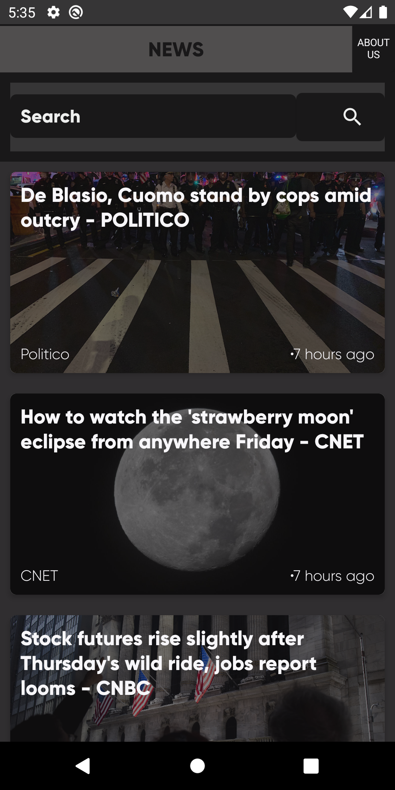
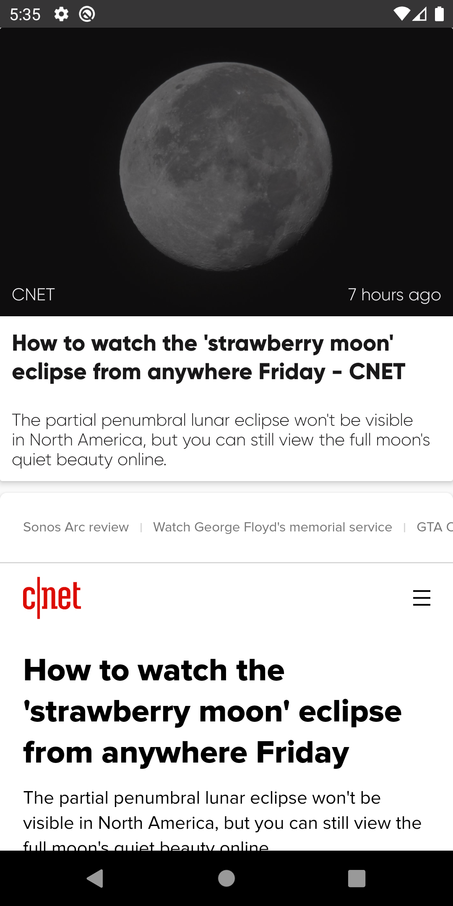
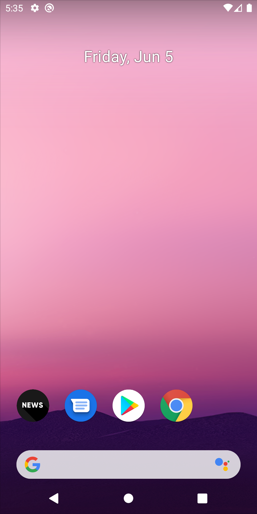

NEWS APP Built using Google News api
news are sorted based on latest news

dependencies:
//Design
    implementation 'com.google.android.material:material:1.0.0'

    //Retrofit
    implementation 'com.squareup.retrofit2:retrofit:2.4.0'
    implementation 'com.squareup.retrofit2:converter-gson:2.2.0'

    //Date/Time
    implementation 'org.ocpsoft.prettytime:prettytime:4.0.1.Final'

    //Picaso for image url
    implementation 'com.squareup.picasso:picasso:2.5.0'

Screenshots:

THIRD PARTY LICENCE:
https://newsapi.org\n
https://square.github.io/retrofit\n
https://material.io/design\n
http://www.ocpsoft.org/prettytime"
